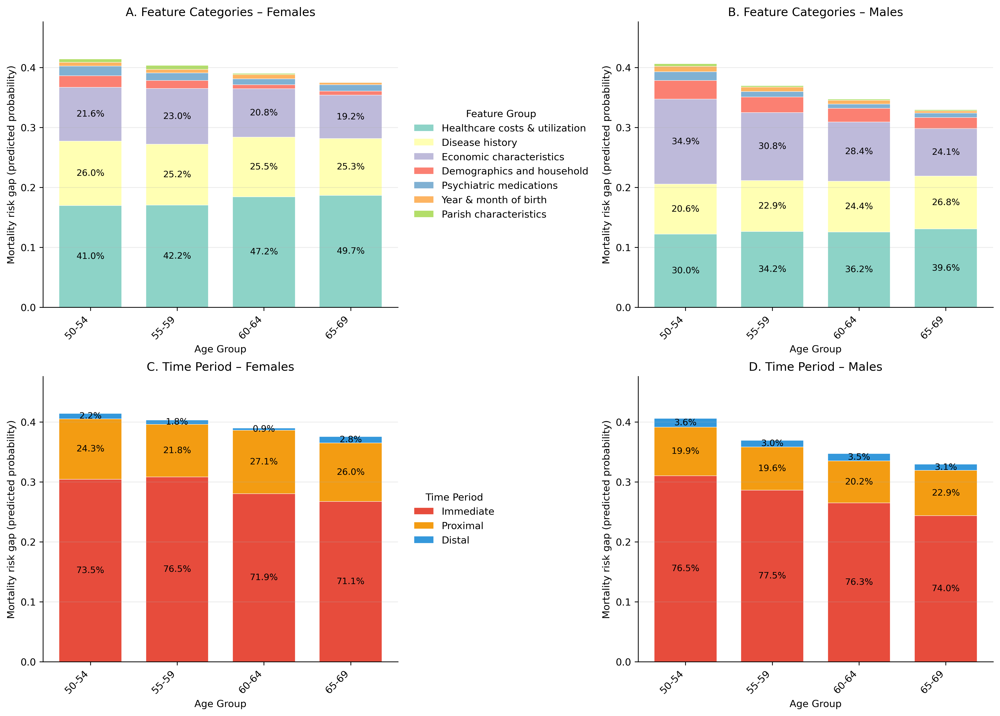
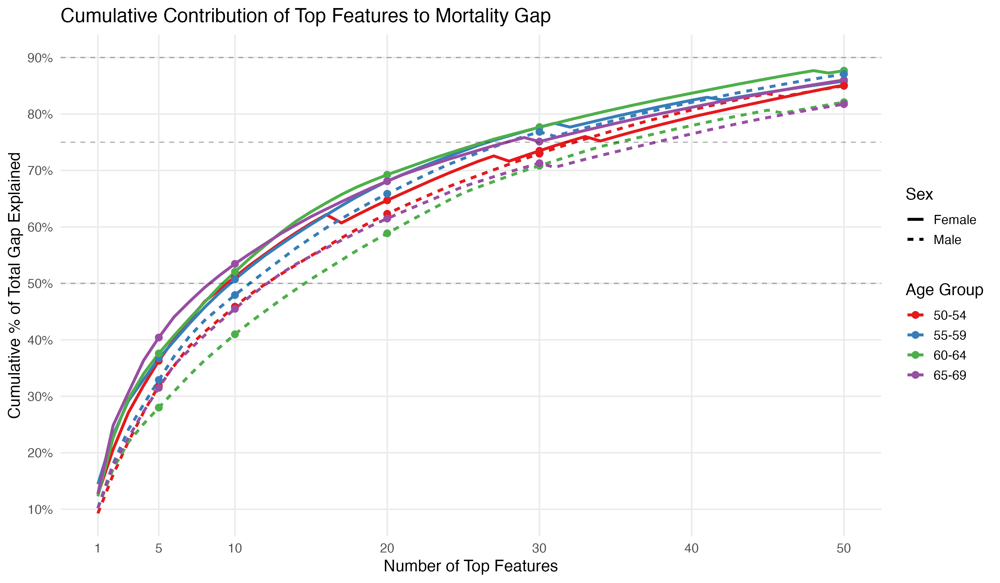

# Pure Health Project Code

This repository contains code for constructing cohorts of Danish adults aged 50–69 and training machine learning models to predict early mortality using linked national register data.

The project integrates **R** and **Python** 

---

## Overview

**Objective**  
To predict mortality among Danish adults aged 50–69 and to evaluate model performance under strong class imbalance, with particular emphasis on recall-oriented metrics.

**Scope**  
The repository supports:
- Cohort construction and feature aggregation
- XGBoost model training using randomized hyperparameter search
- Threshold selection based on F2-score
- Evaluation on held-out test data

The repository also includes SHAP-based model interpretation, decomposition of the predicted mortality gap, and plotting scripts for visualizing feature contributions.

---

## Data and Cohort Design

- Population: Danish adults aged **50–69**
- Age bands:
  - **50–54**
  - **55–59**
  - **60–64**
  - **65–69**
- Observation period: **1995–2023**
- Outcome: `early_death`  
  (1 if death occurs within the age band, 0 otherwise)

Cohorts are constructed separately for each age band.

A detailed overview of variables, descriptions, and data structure is available in:
`Danish_study1_data_dictionary.xlsx`

Because the project uses restricted Danish register data, the raw data are not publicly available.

---

## Script Descriptions

### 1. `01_cohort_data_prep.R`

Builds the analysis cohorts of Danish adults aged **50–69**, stratified into four age bands:

- **50–54**
- **55–59**
- **60–64**
- **65–69**

The script loads yearly Danish panel data (**1995–2023**) and constructs cohort datasets for each age band.

For each cohort, the script:

- identifies individuals entering the age band
- removes left- and right-censored observations
- defines the outcome variable `early_death`
- generates historical features using rolling time windows  
  (**2–6 years** and **7–15 years before index age**)
- merges rolling variables with index variables

The **index age** corresponds to the year immediately preceding the outcome window.

The final output is a **cohort dataset with one row per individual at index age**, containing all features and the outcome variable.

Datasets are saved in **Parquet format** and used for machine learning modelling.

---

### 2. `02_split_format_function.py`

Defines the function `split_and_format_data()` for preparing cohort data for machine learning.

The function:
- Loads a Parquet dataset
- Optionally filters individuals by sex
- Separates ID and outcome variables from feature set
- Splits data into training and test sets (default 70/30), optionally stratified by outcome and calendar year

Variable types are automatically detected and preprocessing is applied as follows:
- **Categorical variables**:
  - Imputed with the constant value `"missing"`
  - One-hot encoded (unknown categories ignored)
- **Numeric variables**:
  - Passed through without transformation. (Numeric variables are intentionally not scaled or imputed, allowing XGBoost to handle missingness and feature scaling internally.)

The function returns:
- Training and test feature matrices
- Training and test outcome vectors
- ID columns for train and test sets  
- A preprocessing specification (`ColumnTransformer`) used in the modeling pipeline

---

### 3. `03_train_xgboost_function.py`

Implements `train_xgboost_model_random()` for training an XGBoost classifier using **randomized hyperparameter search**.

Key features:
- Uses a scikit-learn `Pipeline` combining preprocessing and an `XGBClassifier`
- Tunes hyperparameters using **RandomizedSearchCV**
- Employs **Stratified K-fold cross-validation**
- Supports multi-metric evaluation with refitting based on a user-specified metric:
  - `f1`, `f2`, `recall`, `precision`, `roc_auc`, or `pr_auc`
- Supports class imbalance handling via the `scale_pos_weight` argument

The function returns:
- The best fitted model
- The selected hyperparameters

---

### 4. `04_run_xgboost.ipynb`

Implements the end-to-end modeling workflow for a specific cohort (e.g. sex × age band).

The notebook performs the following steps:

1. **Data loading and splitting**
   - Loads a cohort-specific Parquet dataset
   - Use the split_and_format_data() function to filter by sex and split data into training and test sets stratified by outcome and year

2. **Class imbalance handling**
   - Computes `scale_pos_weight` from the training data.

3. **Model training**
   - Trains an XGBoost model using `train_xgboost_model_random()`
   - Optimizes hyperparameters via randomized search
   - Selects the best model using **F2-score**

4. **Threshold selection**
   - Computes precision–recall curves on the training data
   - Selects the classification threshold that maximizes **F2-score**

5. **Evaluation**
   - Evaluates performance on the test set using:
     - F1 and F2 scores
     - Precision and recall
     - MCC
     - ROC-AUC and PR-AUC
     - Accuracy and balanced accuracy
     - Confusion matrix and specificity

6. **Predicted probability gap**
   - Computes mean predicted mortality probability among:
     - survivors (`y = 0`)
     - deaths (`y = 1`)
   - Reports the difference as a model-implied risk gap
  
7. **Saving artifacts for downstream analyses**

   - Saves the trained XGBoost model as a JSON file
   - Applies the fitted preprocessing pipeline to `X_test`
   - Saves the processed test feature matrix (`X_test_processed`)
   - Saves the corresponding test outcomes (`y_test`)

   These files are used in later analyses.

---

### 5. `05_compute_shap_values.py`

Computes SHAP values for a trained XGBoost model and stores the results for later decomposition analyses.

The script performs the following steps:

1. **Load trained model and test data**
   - Loads the trained XGBoost model from a JSON file
   - Loads the processed test feature matrix (`X_test`)
   - Loads the corresponding test outcomes (`y_test`)

2. **Split test data by outcome**
   - Separates individuals into:
     - early deaths (`y = 1`)
     - survivors (`y = 0`)

3. **Compute predicted probabilities**
   - Computes predicted mortality probabilities for both groups
   - Reports:
     - mean predicted probability among early deaths
     - mean predicted probability among survivors
     - the resulting probability gap

4. **Define SHAP baseline**
   - Randomly samples up to **500 survivors** to form a SHAP background dataset
   - This baseline represents the reference population used for interventional SHAP calculations

5. **Compute SHAP values**
   - Uses `shap.TreeExplainer`
   - Configuration:
     - `feature_perturbation="interventional"`
     - `model_output="probability"`

   SHAP values are computed separately for:
   - early deaths
   - survivors

6. **Save SHAP results**
   - Stores SHAP values together with:
     - predicted probabilities (`pred`)
     - outcome label (`y`)
     - SHAP baseline value

---

### 6. `06_shap_gap_decomposition.R`

Aggregates SHAP values across cohorts and decomposes the predicted mortality gap into feature contributions.

The script performs the following steps:

1. **Load SHAP values**
   - Reads `shap_values.csv` for each cohort:
     - Female_50–54
     - Female_55–59
     - Female_60–64
     - Female_65–69
     - Male_50–54
     - Male_55–59
     - Male_60–64
     - Male_65–69

2. **Reshape SHAP data**
   - Converts the dataset to long format
   - Computes summary statistics by:
     - feature
     - outcome group (`y`)
     - SHAP baseline

   For each feature the script computes:

   - mean SHAP value
   - mean predicted probability
   - observation counts

3. **Compute SHAP gap contributions**

   For each feature:
SHAP gap = mean(SHAP | deaths) − mean(SHAP | survivors)

This represents the contribution of that feature to the **predicted mortality probability gap**.

4. **Assign feature groups**

Features are grouped into interpretable domains:

Features are grouped into interpretable domains:

- Healthcare costs & utilization
- Disease history
- Psychiatric medications
- Economic characteristics
- Demographics and household
- Year & month of birth
- Parish characteristics
- Residual

5. **Assign temporal feature groups**

Variables are additionally categorized by time window:

- Immediate
- Proximal
- Distal
- Residual

6. **Compute mortality rate**

The script calculates the empirical mortality rate within each cohort.

7. **Combine cohorts**

Results are merged across all cohorts and saved.

---

### 7. `07_plot_mortality_gap_decomposition.py`

Creates a four-panel figure showing how the predicted mortality gap is decomposed across feature groups and temporal windows for females and males.

The script performs the following steps:

1. **Load decomposition results**
   - Reads `shap_results_all.csv`

2. **Clean and harmonize group labels**
   - Recodes selected feature-group labels for plotting
   - Extracts sex and age-group labels from `age_bin`

3. **Compute total predicted mortality gap**
   - Calculates the gap as:
     `mean_pred_1 - mean_pred_0`
   - Uses this quantity to scale stacked bars

4. **Aggregate SHAP contributions**
   - Sums SHAP contributions within:
     - feature groups (`group1`)
     - temporal groups (`group2`)

5. **Convert contributions into scaled shares**
   - Computes the percentage contribution of each group within each sex-age cohort
   - Scales contributions so that stacked bars sum to the total predicted mortality gap

6. **Create decomposition plots**
   - Produces a 2 × 2 figure with:
     - feature-category decomposition for females
     - feature-category decomposition for males
     - temporal decomposition for females
     - temporal decomposition for males

7. **Save figure**
   - Saves the figure as:
     `figures/figure1_mortality_gap_decomposition.png`

---

### 8. `08_plot_cumulative_contribution.R`

Creates a cumulative contribution plot showing how much of the predicted mortality gap is explained by the top-ranked features within each sex and age group.

The script performs the following steps:

1. **Load decomposition results**
   - Reads `shap_results_all.csv`

2. **Prepare age and sex labels**
   - Extracts sex and age-group labels from `age_bin`

3. **Compute feature-level contributions**
   - Keeps feature-level SHAP contributions and predicted probabilities
   - Calculates the total predicted mortality gap:
     `mean_pred_1 - mean_pred_0`

4. **Calculate percentage contribution**
   - Expresses each feature’s SHAP contribution as a percentage of the total predicted gap

5. **Rank features**
   - Ranks features by absolute SHAP contribution within each sex-age cohort

6. **Compute cumulative contribution**
   - Calculates the cumulative percentage of the total gap explained by the top features

7. **Create cumulative contribution plot**
   - Plots cumulative explained gap for the top 50 features
   - Uses color for age group and line type for sex

8. **Save figure**
   - Saves the figure as:
     `figures/figure2_cumulative_contribution.png`

## Outputs

The pipeline produces the following outputs:

- **Trained XGBoost models**
  - Saved as JSON files for each cohort

- **Processed test datasets**
  - `X_test_<cohort>.csv`
  - `y_test_<cohort>.csv`

- **Performance metrics**
  - F1, F2, precision, recall
  - ROC-AUC and PR-AUC
  - Accuracy and balanced accuracy
  - Matthews correlation coefficient (MCC)

- **Confusion matrix and derived statistics**
  - True/false positives and negatives
  - Specificity

- **Predicted mortality probability gap**
  - Mean predicted probability among deaths
  - Mean predicted probability among survivors
  - Difference between the two

- **SHAP values**
  - `shap_values.csv` for each cohort

- **SHAP gap decomposition results**
  - Combined SHAP decomposition across cohorts
  - Saved as `shap_results_all.csv`

- **Figures**
  - `figures/figure1_mortality_gap_decomposition.png`
  - `figures/figure2_cumulative_contribution.png`

---

## Example Figures

### Figure 1. Decomposition of the predicted mortality gap

Generated by `07_plot_mortality_gap_decomposition.py`.

### Figure 2. Cumulative contribution of top features

Generated by `08_plot_cumulative_contribution.R`.

## Notes

- All random processes are seeded to ensure reproducibility within cohorts.
