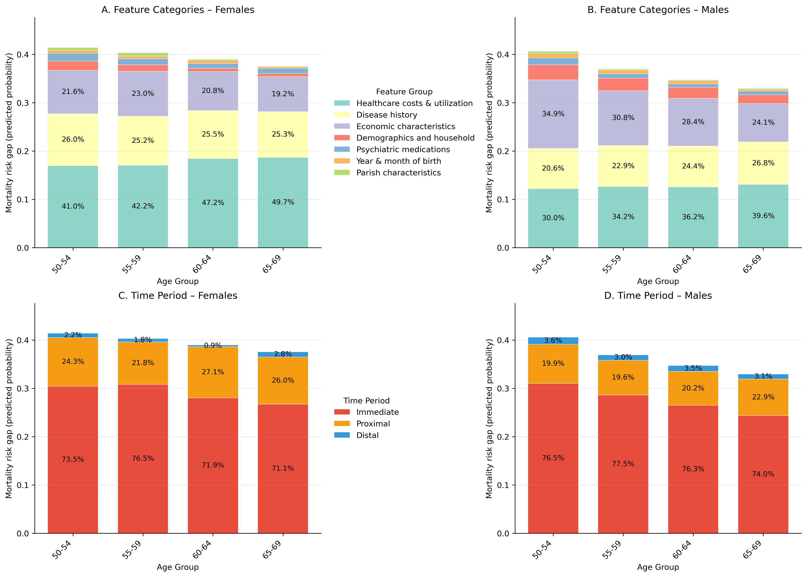
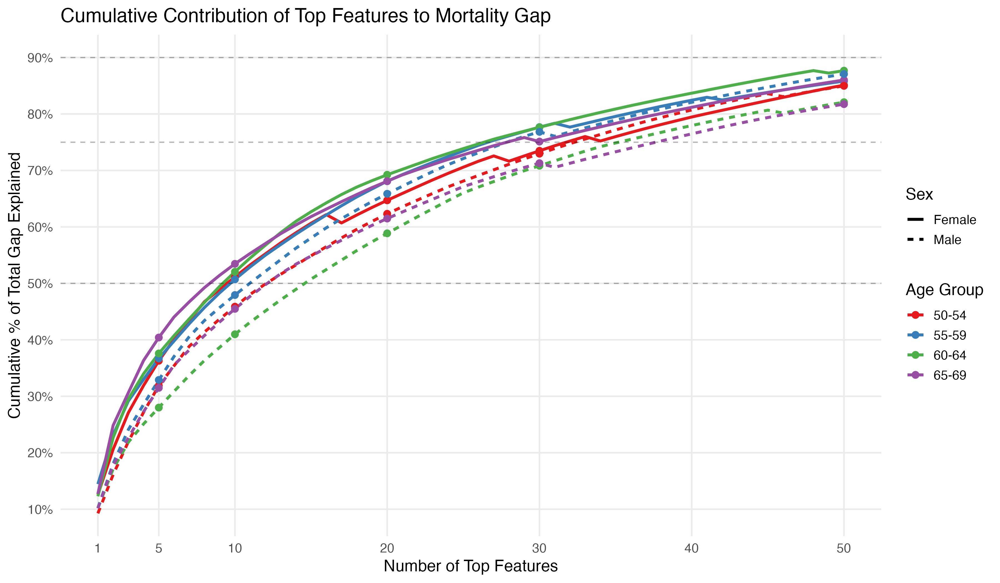

# Pure Health Project Code

This repository contains code for constructing cohorts of Danish adults aged 50–69, training machine-learning models to predict early mortality, and decomposing the predicted mortality-probability gap between early deaths and survivors using SHAP-based methods.

The project combines **R** for cohort construction, rolling-window feature aggregation, descriptive analyses, and selected figures, and **Python** for model training, probability calibration, SHAP computation, evaluation plots, and supplementary analyses.

---

## Overview

### Objective

The objective of this project is to predict early mortality among Danish adults aged 50–69, evaluate model performance under strong class imbalance, and explain differences in predicted mortality risk between early deaths and survivors.

The analysis focuses on sex- and age-specific cohorts and uses SHAP-based decomposition to identify which feature groups and time periods contribute most to the predicted mortality-probability gap.

### Pipeline at a glance

- **Cohort construction and rolling-window feature aggregation** in R.
- **Cohort design:** individuals are included at the minimum age of the age band, and predictors are measured by looking backwards from that index age.
- **Rolling feature windows:** variables are aggregated over 1–5, 6–10, and 11–15 years before the index age.
- **Model training:** XGBoost models are trained in Python using randomized hyperparameter search and F2-based threshold selection.
- **Model variants:** three modelling variants are compared — a raw model, a resampled model, and a probability-calibrated model.
- **Performance evaluation:** model performance is evaluated across sex–age cohorts using ROC and precision–recall curves.
- **Explainability:** SHAP values are computed using tree-based SHAP for the raw XGBoost model and model-agnostic SHAP for the calibrated model.
- **Decomposition:** the predicted mortality gap is decomposed into feature-group and temporal contributions.
- **Figures:** final figures and supplementary prediction plots are produced from saved model and SHAP outputs.

---

## Data and cohort design

- **Population:** Danish adults aged **50–69**.
- **Age bands:** cohorts are built and modelled separately for **50–54, 55–59, 60–64, and 65–69**, each split by **sex**, giving **8 cohorts** in total.
- **Observation period:** yearly register panel data from **2000–2023**.
- **Outcome:** `early_death` — 1 if death occurs within the age band, 0 otherwise.
- **Index age:** the lower bound of the age band. For example, the 50–54 cohort is indexed at age 50, the 55–59 cohort at age 55, and so on.
- **Feature timing:** one row per individual is kept at index age. Rolling predictors are measured retrospectively by looking backwards from this index age.
- **Rolling feature windows:**
  - **1–5 years** before index age (*proximal*)
  - **6–10 years** before index age (*distal*)
  - **11–15 years** before index age (*distal*)

Variables measured at the index age itself are treated as immediate variables. Numeric variables are summarized using rolling means and standard deviations; diagnosis, medication, and other binary indicators are summarized as rolling `max` / “ever present”; and selected categorical variables are converted into indicators for whether a given category was present within the window.

Because the project uses restricted Danish register data, the raw data are **not publicly available**. A detailed overview of variables and data structure is provided in `data_dictionary.xlsx`.

> **Paths:** Several scripts reference absolute paths inside the secure register environment, such as `/Data_files/...`, `/Anne/Data_files/...`, and `/XBoost_results/...`. These paths describe the original project structure and must be adapted if the code is run in another environment.

---

## Repository structure

Scripts are numbered in the order they are intended to be read or run. Letter suffixes, such as `02a`, indicate helper scripts or related scripts within the same pipeline step.

```text
preprocess/
  01_cohort_data_prep.R
  01a_generate_rolling_variables.R
  cohort_data_prep_expanded.R
  calculate_charlson.R
  DEX_ICD_map_v148.csv
  DEX_causelist_v148.csv

modelling/
  02_run_raw_xgboost.ipynb
  02a_split_format.py
  02b_xgboost_model.py
  03_run_resampling.ipynb
  03a_resample.py
  04_run_calibration.ipynb
  05_combined_evaluation_plots.py

shap_analysis/
  06a_compute_shap_values_raw_model.py
  06b_compute_shap_values_calibrated.py
  07_shap_gap_decomposition.qmd

figures/
  08_plot_mortality_gap_decomposition.py
  09_plot_cumulative_contribution.R

descriptives/
  descriptive.py

prediction_plots/
  predictions_death_cause.R
  false_positives_age_at_death.R
  predicted_probability_density.R

data_dictionary.xlsx
environment.txt
README.md
```

> **Note on numbering and imports:** The modelling notebooks import helper modules by their plain module names, for example `from split_format import ...`.

---

## Script descriptions

## Preprocessing

### `01_cohort_data_prep.R`

Builds one analysis cohort. The age band is set at the top of the script using `min_age` and `max_age`, so the script is rerun once per age band.

For the selected age band, the script:

- reads yearly register panel files and keeps individuals resident in Denmark within the relevant age range;
- defines cohort membership, keeping individuals first observed at the minimum age of the band and followed through the band unless death occurs within the band;
- removes deaths that fall outside the available data range;
- defines rolling feature windows of 1–5, 6–10, and 11–15 years before index age;
- creates rolling features using `generate_rolling_variables()`;
- creates rolling variables by summarizing numeric variables within each lookback window using the rolling mean and standard deviation, while binary and categorical variables are summarized using the rolling maximum (`max`), indicating whether the value was observed at least once during the window;
- merges the rolling features back to the cohort panel;
- keeps one row per individual at index age;
- defines `early_death`;
- writes the final cohort dataset.

### `01a_generate_rolling_variables.R`

Helper script used to generate rolling-window variables.

Given a variable configuration, the function uses DuckDB window functions partitioned by person and ordered by year. For numeric variables, it can compute rolling statistics such as mean, standard deviation, minimum, maximum, sum, and median. For categorical or binary variables, it creates indicators for whether a specific value was present within the requested lookback window.

The output is a merged `data.table` with one row per person-year and the generated rolling variables.

### `cohort_data_prep_expanded.R`

A more detailed version of the cohort-building script. It follows the same general design: the cohort is defined by an age band, the index age is set to the minimum age of that band, and rolling variables are measured retrospectively from the index age.

Compared with the streamlined `01_cohort_data_prep.R`, this version configures a broader feature set, including medication flags, employment-status categories, family death events, healthcare utilization, costs, comorbidity scores, diagnosis counts, and medication counts. It also includes more explicit handling of left- and right-censoring and blanks hospitalisation counts in each person’s entry year.

The script is retained for reference; the streamlined `01_cohort_data_prep.R` is the current main preprocessing script.

### `calculate_charlson.R`

Reference script showing how Charlson and Elixhauser/van Walraven comorbidity measures can be calculated from LPR diagnosis data.

The script uses monthly LPR diagnosis information with a 5-year lookback window. ICD-10 definitions and published weighting schemes are used to create comorbidity indicators and summary scores. This script documents the comorbidity methodology and may not be the exact script run in the final preprocessing pipeline.

### `DEX_ICD_map_v148.csv` and `DEX_causelist_v148.csv`

Reference lookup files used to map ICD-10 diagnosis or cause-of-death codes into broader cause categories and human-readable labels.

These files support upstream construction of diagnosis features and are also useful for supplementary analyses involving cause of death.

---

## Modelling

### `02a_split_format.py` — `split_and_format_data()`

Helper function used throughout the modelling notebooks to prepare cohort datasets for model training and evaluation.

The function loads the cohort Parquet file, optionally filters by sex, removes the outcome column and ID/leakage columns, and splits the data into **fit** (training), **calibration**, and **test** sets.

Categorical variables are filled with `"missing"` and one-hot encoded. Numeric variables are passed through unchanged, since XGBoost can handle missing values internally. The function returns the feature matrices, outcome vectors, ID columns, and a preprocessing transformer that is fitted later as part of the modelling pipeline.

### `02b_xgboost_model.py` — `train_xgboost_model_random()`

Defines the shared XGBoost training function used by the modelling notebooks.

The function builds a scikit-learn pipeline with preprocessing followed by an `XGBClassifier`, then performs randomized hyperparameter search using stratified k-fold cross-validation. The search evaluates several metrics, including `f1`, `f2`, `recall`, `precision`, `roc_auc`, and `pr_auc`, and refits the final model using the selected optimization metric, typically F2.

Class imbalance can be handled through `scale_pos_weight`. The function returns the best fitted pipeline and its selected hyperparameters. The classification threshold is chosen afterwards in the run notebooks.

### `02_run_raw_xgboost.ipynb`

Runs the raw XGBoost model for one sex–age cohort.

The notebook loads and splits the cohort data, computes `scale_pos_weight` from the training data, trains the XGBoost model using randomized hyperparameter search, and selects the classification threshold that maximizes F2 on the training precision–recall curve.

The trained model is then evaluated on the test set using standard classification metrics, including precision, recall, F1, F2, ROC-AUC, PR-AUC, balanced accuracy, accuracy, MCC, specificity, and the confusion matrix. The notebook also computes the predicted mortality-probability gap, defined as the difference in mean predicted risk between early deaths and survivors.

Saved outputs include the trained XGBoost model, processed test data, predictions, performance metrics, and result summaries. This raw model is the basis for the tree-based SHAP analysis.

### `03a_resample.py`

Contains helper functions for handling class imbalance by resampling the training data.

The available approaches are:

- upsampling the minority class;
- downsampling the majority class;
- downsampling the majority class to obtain a fixed positive rate.

The main resampling notebook uses `resample_to_target_rate()`, which keeps all positive cases and downsamples the negative cases until the requested positive rate is reached.

### `03_run_resampling.ipynb`

Runs the same overall XGBoost workflow as the raw model, but handles class imbalance through training-set resampling instead of `scale_pos_weight`.

The notebook first splits the cohort data, then resamples the fit (training) set to increase the share of early-death cases. The model is trained on this resampled training data, and the F2-maximizing threshold is selected on the training precision–recall curve.

Evaluation and saved outputs mirror the raw-model notebook, allowing the resampled model to be compared directly with the raw model.

### `04_run_calibration.ipynb`

Runs the probability-calibrated modelling workflow.

The notebook first trains an XGBoost model using `scale_pos_weight`, then fits an isotonic calibration model on a held-out calibration set. The calibrated model is used to produce calibrated predicted mortality probabilities.

The notebook compares raw and calibrated probabilities using a calibration curve, selects the F2-maximizing threshold on the calibration set, and evaluates the calibrated predictions on the test set.

Saved outputs include the calibrated model, calibration data, calibrated predictions, performance metrics, and result summaries. This calibrated model is the basis for the model-agnostic SHAP analysis.

### `05_combined_evaluation_plots.py`

Aggregates saved test-set predictions across tne cohort-results folders and creates combined evaluation plots.

For each cohort, the script loads the saved model and test data, computes ROC and precision–recall curves, and stores the results with the cohort label.

The script saves two overlay figures:

- `combined_roc.png`
- `combined_pr.png`

These plots provide a visual comparison of discrimination and precision–recall performance across sex–age cohorts.

---

## SHAP analysis

### `06a_compute_shap_values_raw_model.py`

Computes SHAP values for the raw XGBoost model.

The script loads the saved raw model and processed test data for one cohort, splits the test set into early deaths and survivors, and reports the predicted mortality-probability gap.

It then samples 5,000 survivors as the SHAP background distribution and uses `shap.TreeExplainer` with `model_output="probability"` to compute feature-level contributions to predicted mortality risk. SHAP values are computed for both early deaths and survivors in the test set.

The output is saved as `shap_values.csv` and contains the SHAP values for each feature together with the observed outcome (`y`), predicted probability (`pred`), and SHAP baseline value (`baseline`).

### `06b_compute_shap_values_calibrated.py`

Computes SHAP values for the probability-calibrated model.

Because the calibrated estimator is not a plain XGBoost tree model, the script uses model-agnostic SHAP with a custom prediction function that returns calibrated mortality probabilities.

The script loads the calibrated model and calibration data, encodes categorical variables for SHAP, and decodes them again inside the prediction function so that predictions are made using the same calibrated pipeline. It samples up to 500 survivors as the background distribution and explains up to 100 early deaths and 100 survivors from the calibration set.

The output is saved as `calibrated_shap_values.csv` and contains SHAP values for each feature together with the observed outcome (`y`), calibrated predicted probability (`pred`), and SHAP baseline value (`baseline`).

### `07_shap_gap_decomposition.qmd`

Aggregates the cohort-level SHAP files and decomposes the predicted mortality-probability gap between early deaths and survivors.

For each feature, the decomposition is calculated as the difference between the mean SHAP value among early deaths and the mean SHAP value among survivors. Features are then grouped into broader interpretable categories, such as healthcare costs and utilization, disease history, psychiatric medication, economic characteristics, demographics and household characteristics, and parish characteristics.

Features are also grouped by timing, distinguishing immediate variables from proximal and distal rolling-window features.

The document writes decomposition outputs for the raw model and the calibrated model as well as a sensitivity to number of people chosen as baseline, including:

- `shap_results_all.csv`
- `calibrated_shap_results_all.csv`
- `shap_results_baseline_sensitivity.csv`

These files are used as inputs for the final mortality-gap decomposition figures.

---

## Figures

### `08_plot_mortality_gap_decomposition.py` — Figure 1

Creates the main mortality-gap decomposition figure from `shap_results_all.csv`.

The script groups SHAP contributions by feature category and by timing of measurement. Feature categories include healthcare costs and utilization, disease history, economic characteristics, demographics and household, psychiatric medications, year and month of birth, and parish characteristics. Timing groups distinguish immediate, proximal, and distal variables.

For each sex–age cohort, the script calculates the total predicted mortality-risk gap as the difference between the mean predicted probability among early deaths and survivors. Group-level SHAP contributions are converted into percentage shares and then scaled so that each stacked bar sums to the cohort’s total predicted risk gap.

The final figure is a 2 × 2 panel:

- feature-category decomposition for females;
- feature-category decomposition for males;
- temporal decomposition for females;
- temporal decomposition for males.

The output is saved as `figures/figure1_mortality_gap_decomposition.png`.

### `09_plot_cumulative_contribution.R` — Figure 2

Creates the cumulative-contribution figure from `shap_results_all.csv`.

For each sex–age cohort, the script ranks features by their absolute SHAP contribution to the predicted mortality gap. It then calculates the cumulative percentage of the total gap explained as more top-ranked features are added.

The plot shows the cumulative contribution of the top 50 features, with separate lines by sex and age group. Reference lines at 50%, 75%, and 90% indicate how concentrated the mortality-gap explanation is among the most influential features.

The output is saved as `figures/figure2_cumulative_contribution.png`.

---

## Descriptives

### `descriptives/descriptive.py`

Creates descriptive summary tables for one selected cohort. The cohort and sex are set at the top of the script using `COHORT_NAME` and `SEX`.

The script loads the cohort Parquet file, optionally filters to males or females, removes ID and geography columns, and splits the data into survivors and early deaths based on `early_death`.

Variables are automatically classified as continuous, binary, or categorical:

- continuous variables are summarized as mean ± standard deviation and standardized mean differences 
- binary variables are summarized as percentages and risk ratios for death;
- categorical variables are expanded to levels and summarized as percentages with risk ratios for death.

Very rare binary or categorical levels with fewer than three exposed individuals are removed from the output. The results are saved as a multi-sheet Excel workbook with separate sheets for continuous, binary, and categorical variables.

---

## Supplementary prediction plots

The `prediction_plots/` folder contains supplementary scripts for inspecting model predictions in more detail.

### `predictions_death_cause.R`

Links test-set predictions to registered cause of death and summarizes which causes of death are more often captured by the model.

The script distinguishes true positives from false negatives among individuals who died and can be used to examine whether predictive performance differs across cause-of-death groups.

### `false_positives_age_at_death.R`

Examines false positives: individuals predicted to die within the age band who did not die during the prediction window.

The script investigates the later age at death among these false positives, which can help assess whether some “false positives” may represent people with elevated longer-term mortality risk.

### `predicted_probability_density.R`

Plots the distribution of predicted mortality probabilities by true outcome.

The plot helps visualize separation between early deaths and survivors, the overlap between the groups, and the position of the selected decision threshold.

---

## Outputs

The pipeline produces several types of outputs:

### Cohort data

- Final cohort Parquet files, one per age band.

### Trained models

- Raw XGBoost model files.
- Resampled XGBoost model files.
- Probability-calibrated model files.

### Processed data and predictions

- Processed test data.
- Calibration data for calibrated models.
- Predicted probabilities and predicted classes.
- Saved outcome vectors and ID columns.

### Performance metrics

- F1/F2 
- precision
- recall
- ROC-AUC
- PR-AUC 
- accuracy 
- balanced accuracy
- MCC 
- confusion matrix 
- specificity
- predicted-probability gap with bootstrap CI

---

## Example figures

### Figure 1. Decomposition of the predicted mortality gap
Generated by `08_plot_mortality_gap_decomposition.py`.



### Figure 2. Cumulative contribution of top features
Generated by `09_plot_cumulative_contribution.R`.



---

## Notes

- Cohort, sex, and age-band selections are set at the top of the relevant scripts/notebooks and rerun per cohort.
- Random processes are seeded for reproducibility within cohorts.
- Class imbalance is addressed three ways across the runs: `scale_pos_weight` (raw), training-set resampling (resampling), and isotonic probability calibration (calibration).
</content>
</invoke>

